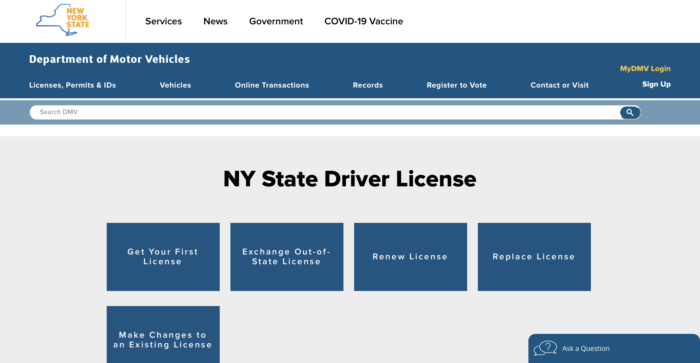
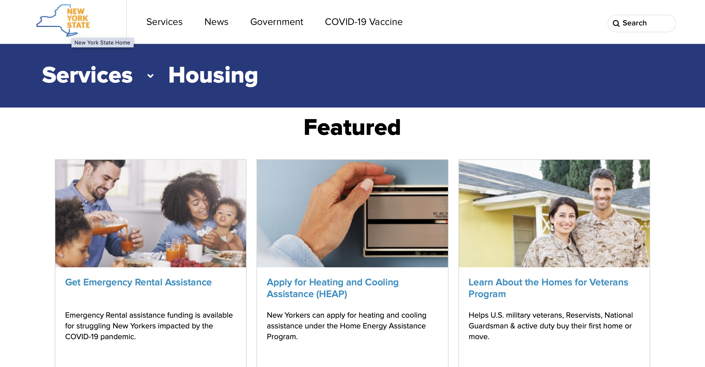

# Heuristic Evaluation: New York Government Websites
# Assignment 1: Heuristic Evaluation
### Kristina Thabet / DH 110 / Fall 2021
## About the Project 
As society becomes more technology focused, it is important to make sure users are able to interact with websites in an efficent and easy manner. Although teachnological advances has made information widely accessible, it has unfortunately left older indivuduals confused because they are less skilled at interacting with websites. Heuristic evaluations are neccessary to ensure that websites are user friendly for all ages. Even small details such as placement of tabs or picture size can affect the experience users have with the website. For this assignment, I will be analyzing the New York Drivers License Website as well as the New York Housing Services Page to assess how to improve user experience and website functionality. I hope to demonstrate how to improve the New York Drivers License website and the New York Housing Services website for not only the elderly, but every individual.  

# [Jakob Nielsen's 10 Usability Heuristics for User Interface Design](https://www.nngroup.com/articles/ten-usability-heuristics/) 

#### 1- Visibility of System Status
The design of the website should keep users informed about wesite status and provide feedback in a resonable time frame. An example of this would be "You Are Here" indicators on directories. 
#### 2- Match Between System and the Real World
The design should be in the same language as the users and have understandable jargon. Ther information should appear natural and in tune with words used in the real world.
#### 3- User Control and Freedom
Users need to be able to easily exit when they perform an unwanted task.
#### 4- Consistency and Standards
Words, situations, and actions should all be kept consistent to reduce user confusion. An example of this would be how hotel check in is always at the front of the hotel. Users appreciate consistency. 
#### 5- Error Prevention
Eliminate error- prone conditons or allow users to confirm before they make an error prone action. Make sure error messages are clear if error is not prevented. 
#### 6- Recognition Rather Than Recall
Make users life easier by making as many options as possible visible so users do not how to memorize how to complete actions. 
#### 7- Flexibility and Efficiency of Use
Have shortcuts in the design to tailor to both advanced users and novice users. Allow users to tailor the actions made on the website. 
#### 8- Aesthetic and Minimalist Design
Leave out irrelevant information on the interface. 
#### 9- Help Users Recognize, Diagnose, and Recover From Errors
Have very clear error messages in plain language that tells users what to do to recover from an error. 
#### 10- Help and Documentation 
Have help and documentation easily searchable so users can reach out for extra help if needed.

# Severity Ratings for Usability Problems
The following rating scale will be used to assess the severity of usability problems for both websites below. 
#### Rating 1: 
Mostly cosmetic issues. These issues only needs to be fixed is time allows.
#### Rating 2:
Minor usablilty issues. There are important but not crucial.
#### Rating 3: 
Major usablilty issues. These issues should be first priority. 

# Website 1: [New York State Driver License Website](https://dmv.ny.gov/driver-licenses)
## About 
The New York DMV Website is where users can renew, replace, make changes to, and get a license. This website also handles all registration for vehicles as well as permits, ID's, and more. On the website, you can also find all information and contacts pertaining to the Department of Motor Vehicles. This website serves the public by licensing drivers, securing identities, and regualting the vehicle industry. My goal is to improve user's experience of navigating this important website by providing a heuristic evaluation.

## Intitial Overall Heuristic Evaluation
Before digging deeply, the New York State Driver License website came off boring, bare, and spread out. There are no photos on the website and the only colors used are blue, white, and black. When users move the cursor over a tab, the tab does not react at all, potentially making users feel like the website is unresponsive to the cursor. On a positive note, all large driver license related needs are layed out and easy to read on the opening page of the website. There is an easily accessible search tab as well as an "Ask a Question" feature on the bottom. See below for a deeper heuristic evaluation.

#### 1- Visibility of System Status
#### 2- Match Between System and the Real World
#### 3- User Control and Freedom
#### 4- Consistency and Standards
#### 5- Error Prevention
#### 6- Recognition Rather Than Recall
#### 7- Flexibility and Efficiency of Use	
#### 8- Aesthetic and Minimalist Design
#### 9- Help Users Recognize, Diagnose, and Recover From Errors
#### 10- Help and Documentation 

# Website 2: [New York State Housing Services Website](https://www.ny.gov/services/housing)
## About 

#### 1- Visibility of System Status
#### 2- Match Between System and the Real World
#### 3- User Control and Freedom
#### 4- Consistency and Standards
#### 5- Error Prevention
#### 6- Recognition Rather Than Recall
#### 7- Flexibility and Efficiency of Use	
#### 8- Aesthetic and Minimalist Design
#### 9- Help Users Recognize, Diagnose, and Recover From Errors
#### 10- Help and Documentation 
